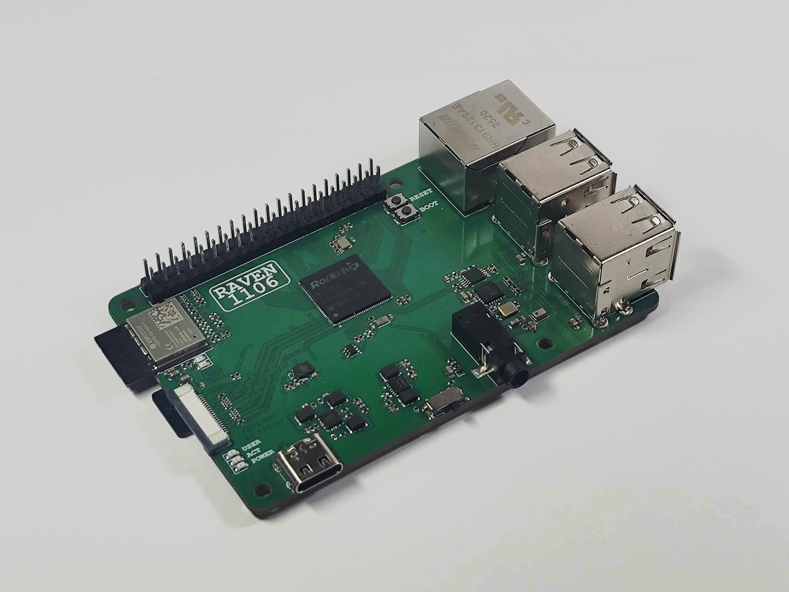

# Raven1106

Raspberry Pi-like single board computer based on the Rockchip RV1106G3.



## Overview

Raven1106 is a custom open-hardware SBC. This repository contains everything
related to the project including: the board schematics and the PCB design, build
scripts, configurations, device trees and file system overlays for the 
operating system images and all the patches needed to get everything working.

- CPU: Single-core Cortex-A7 @ 1.6 GHz
- RAM: 256MB DDR3L @ 924MHz
- Storage: SD card
- Ethernet: Full-size 100 MBit/s Ethernet port
- USB: Four USB-A ports routed through CH334F or one OTG USB-C port
- WiFi: ESP32C6 with ESP-Hosted firmware (_currently not functional_)
- Kernel: Linux 5.10 (Rockchip BSP)
- U-Boot: 2017.09 (Rockchip BSP)
- OS images: Debian 12 (bookworm, armhf) or Buildroot (musl)

## Why does it exist?

TLDR: It's a learning project

> The main goal of this project was to be a learning experience for designing complex high-speed digital PCBs. Creating an SBC that is almost capable enough to do basic tasks like hosting simple servers or running AI harnesses is a nice bonus. RV1106 was chosen specifically for its simplicity, integrated RAM meant no DDR routing and QFN package meant I could solder the board manually relatively easily. 

> What this chip lacked in the hardware it made up for in the software side of things -- BSP is absolutely terrible, outdated, barely documented (_though with a lot of spelling mistakes_). Programming it wasn't much better either with only a few barely working flashing tools and a USB controller that might not actually be compliant with the USB spec, as most machines can't even enumerate it. It might have been genuinely easier to make this project around a more complex BGA part than this SoC.

## PCB

The board is designed in KiCad (4-layer). `pcb/` contains two revisions:

- `pcb/v1.0` — first revision
- `pcb/v1.1` — revision with component value fixes (no PCB layout changes)

| Layer 1 - Signal | Layer 2 - Ground Plane | Layer 3 - Power Planes | Layer 4 - Signal |
| :-: | :-: | :-: | :-: |
|  |  |  |  |


### Known v1.0 hardware issues and their fixes

**USB Impedance Miscalculation** - Turns out that FSUSB42MUX doesn't act as a retransmitter but like a normal switch which adds ~10 ohm impedance to the line. **Fix:** Swap `RN301` with 0-ohm and change `R301` and `R302` from 22 ohm to 10 ohm. This results the line impedance that is well in spec.

**No pullups on FSPI Flash** - Speaks for itself, thankfully the RV1106 has internal pull-ups that enable the chip and disable the write protection. And we don't even use it so it's a non-issue. _Cannot fix this without board changes._

**LED resistors too small** - The LEDs shine too brightly with 1k resistors. **Fix:** Change `R3`, `R4` and `R5` from 1k to 10k resistors.

**USB Hub crystal load too large** - The CH334F is designed to work with a crystal with no load caps, adding them causes the oscillation to die down. **Fix:** Change `R309` from 1k to 10 ohm, remove `C302` and `C303`.

**Boot button pull-up too strong** - With 1k the button does not affect the chip's boot at all. **Fix:** Change `R6` from 1k to 10k.

**Wrong ESP_BOOT pin exposed** - It should be pin 9, not pin 8. **Fix:** No way to fix it without modifying the board unfortunately, just flash the bootloader before soldering the ESP.

**Reference clock not connected to the camera** - Turns out not all camera modules have their own crystal oscillators. SC3336 requires a reference clock; RV1106 has two reference clock outputs, one of them is connected to the camera's reset and the other one to the IMU interrupt pin. **Fix:** Add a jumper from `R508` to `R515`.

> Most of these problems could have been prevented with "RTFM" (Reading The F***ing Manual).

## Repository layout

| Path | Contents |
|---|---|
| `configs/` | Defconfigs (kernel, U-Boot, Buildroot, crosstool-ng), device tree source, SD image layout, U-Boot env, user table |
| `kernel/` | Linux 5.10 Rockchip BSP kernel |
| `uboot/` | U-Boot 2017.09 Rockchip BSP |
| `buildroot/` | Buildroot (2026.08-git) |
| `buildroot-overlayfs/` | Rootfs overlay for the Buildroot image |
| `debian/`, `debian-overlayfs/` | Debian rootfs staging area and overlay |
| `crosstool-ng/`, `legacy-toolchain/` | Legacy uClibc toolchain (kernel/U-Boot builds) |
| `esp-hosted/` | ESP32-C6 host driver source (esp_hosted_ng) |
| `rkbin/` | Rockchip binary blobs (DDR init, trust) |
| `scripts/build.sh` | Image assembly, Debian rootfs, Docker environment |
| `images/` | Build artifacts and final `sdcard.img` |
| `pcb/` | KiCad hardware design |
| `docs/` | RV1106 datasheet / reference manuals |

## Building

### Build environment

All builds run inside a Docker container. The first invocation builds the
`rv1106-build` image, then drops you into a shell with the repository
mounted at `/work`:

```sh
make docker
```

### Debian image (default)

```sh
make debian-image
```

This builds the kernel, device tree, and U-Boot, then creates a Debian 12
(bookworm, armhf) rootfs with debootstrap (using qemu-user-static/binfmt for
the second stage) and assembles `images/sdcard.img`.

Notes:

- Default login: user `debian`, password `raven` (sudo user, SSH enabled).
  Override with the `BOARD_USER` and `DEBIAN_PASSWORD` environment variables.
- Included packages: systemd, ifupdown, openssh-server, sudo, dhcp client,
  busybox, vim-tiny, ca-certificates (see `DEBIAN_PACKAGES` in
  `scripts/build.sh`).
- Rootfs image size: 512 MB (`DEBIAN_ROOTFS_SIZE`).
- For now there's no autoresize, run `sudo resize2fs /dev/mmcblk1p5` after
  the first boot.

### Buildroot image

```sh
make            # default target: br2-image + toolchain-link
# or explicitly:
make br2-image
```

This builds the kernel, device tree, U-Boot, copies kernel modules into
`buildroot-overlayfs/usr/ko/`, builds Buildroot with its rootfs overlay, and
assembles `images/sdcard.img`. Default login: user `user`, password `raven`
(from `configs/users.txt`).

### Component targets

| Target | Description |
|---|---|
| `make kernel` | Build the kernel using the legacy toolchain |
| `make dtb` | Preprocess and compile `configs/device-tree.dts` into `images/` |
| `make uboot` | Build U-Boot (SPL + idblock + uboot.img) |
| `make buildroot` | Build the Buildroot rootfs |
| `make espdriver` | Build the ESP32-C6 host driver against the kernel |
| `make legacytoolchain` | Build the crosstool-ng uClibc toolchain |
| `make docker` | Build/enter the Docker build environment |
| `make *-clean` | Clean kernel / U-Boot / Buildroot build trees |

### Configuration targets

Each of these copies the stored defconfig from `configs/`, opens
`menuconfig`, and saves the result back to `configs/`:

```sh
make kernel-config
make uboot-config
make buildroot-config
make legacytoolchain-config
```

### Toolchains

Two toolchains are used:

- **Legacy uClibc toolchain** (`legacy-toolchain/`, built with crosstool-ng):
  used for the kernel and U-Boot.
- **Buildroot musl toolchain** (`buildroot/output/host/`): used for the ESP
  host driver. `make toolchain-link` symlinks it to `./toolchain`.

## Output artifacts

All artifacts land in `images/`:

| File | Description |
|---|---|
| `sdcard.img` | Final flashable SD card image |
| `download.bin`, `idblock.img`, `uboot.img` | Bootloader stages |
| `Image`, `zImage`, `device-tree.dtb` | Kernel and device tree |
| `env.img` | U-Boot environment (from `configs/image-env.txt`) |
| `boot.vfat` | FAT32 boot partition (kernel + dtb) |
| `rootfs.ext4`, `rootfs.tar` | Root filesystem |

### SD card layout

The image has no MBR/GPT; partitions are defined by the kernel command line
(`blkdevparts`, see `configs/sdcard-image.cfg` and `configs/image-env.txt`):

| Partition | Offset | Size | Contents |
|---|---|---|---|
| env | 0x0 | 32 KiB | U-Boot environment |
| idblock | 0x8000 | 512 KiB | Rockchip ID block (SPL) |
| uboot | 0x88000 | 256 KiB | U-Boot |
| boot | 4 MiB | 64 MiB | FAT32: kernel image + device tree |
| rootfs | 68 MiB | remainder | ext4 root filesystem |

## Flashing and first boot

```sh
sudo dd if=images/sdcard.img of=/dev/sdX bs=4M status=progress conv=fsync
```

Serial console: `ttyFIQ0` at 115200 baud.
